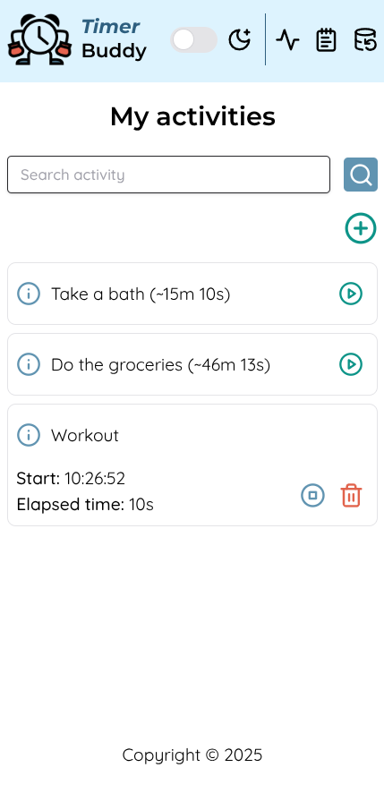
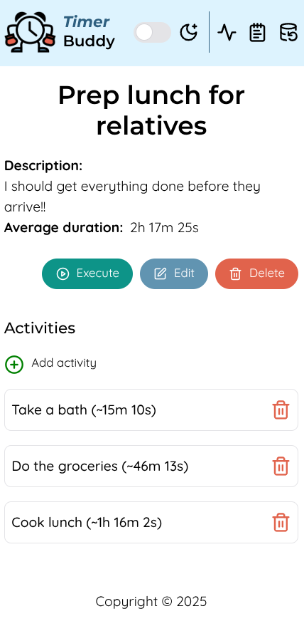
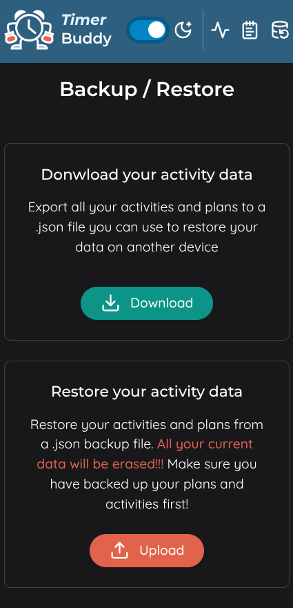

# ⏱️ Timer Buddy

> Track your time, organize your day.

**Timer Buddy** is a lightweight demo productivity tool built with [SvelteKit](https://kit.svelte.dev/) and [Tailwind CSS](https://tailwindcss.com/). It helps you **track how much time you spend on your daily activities**, calculate average durations, and **group activities into custom plans** to estimate total time for complex routines.

🔗 **Try it now**: [https://timer-buddy.vercel.app/](https://timer-buddy.vercel.app/)

---

## ✨ Features

- ⏳ Start and stop timers for each activity
- 📊 Automatic average duration per activity
- 🧩 Group activities into "plans" for full-process time estimates
- 💾 **All data is stored locally** using browser Local Storage
- 🔐 Use without account or login — fully private
- 📥 Export and import your data as a `.json` file to restore on another browser or device

---

## 🖼️ Screenshots

| Activities                                     | Create Plan                            | Data Export                              |
| ---------------------------------------------- | -------------------------------------- | ---------------------------------------- |
|  |  |  |

---

## 🛠️ Tech Stack

- [SvelteKit](https://kit.svelte.dev/)
- [Tailwind CSS](https://tailwindcss.com/)
- LocalStorage API

---

## 🔐 Privacy & Data

Timer Buddy stores all user data **locally in your browser**. It never sends any data to a server — your activities and plans remain 100% private.

---

## 📤 Backup & Restore

Use the **Export** option to download a JSON file with all your data. Later, you can **Import** it in any browser to restore your activities and plans.

---

## 📎 License

This project is licensed under the [MIT License](LICENSE).
